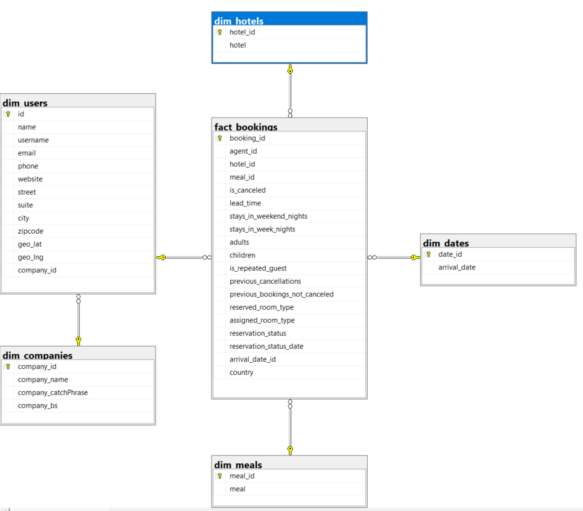

# Data-Driven

## Data Sources
### 1. Users API

- **URL:** [https://jsonplaceholder.typicode.com/users](https://jsonplaceholder.typicode.com/users)

### 2. Hotel Booking CSV Data

#### Fields:

- **hotel:** Hotel type (H1 = Re Hotel or H2 = City Hotel)
- **is_canceled:** Value indicating if the booking was canceled (1) or not (0)
- **lead_time:** Number of days that elapsed between the entering date of the booking into the PMS and the arrival date
- **arrival_date_year:** Year of arrival date
- **arrival_date_month:** Month of arrival date
- **arrival_date_day_of_month:** Day of arrival date
- **stays_in_weekend_nights:** Number of weekend nights (Saturday or Sunday) the guest stayed or booked to stay at the hotel
- **stays_in_week_nights:** Number of week nights (Monday to Friday) the guest stayed or booked to stay at the hotel
- **adults:** Number of adults
- **children:** Number of children
- **meal:** Type of meal booked (Undefined/SC – no meal package; BB – Bed & Breakfast; HB – Half board; FB – Full board)
- **country:** Country of origin (ISO 3155–3:2013 format)
- **is_repeated_guest:** Value indicating if the booking name was from a repeated guest (1) or not (0)
- **previous_cancellations:** Number of previous bookings canceled by the customer prior to the current booking
- **previous_bookings_not_canceled:** Number of previous bookings not canceled by the customer prior to the current booking
- **reserved_room_type:** Code of room type reserved
- **assigned_room_type:** Code for the type of room assigned to the booking
- **agent:** ID of the agent that made the booking
- **reservation_status:** Reservation last status (Canceled, Check-Out, No-Show)
- **reservation_status_date:** Date at which the last status was set

# Pipeline
To run properly the pipeline use the **pipeline.py** file. Pipeline can be executed separately in each fase extract, tranform or load.
Before running the load step, ensure that you have configured a connection to a Microsoft SQL Server. Provide the connection details in the `config.json` file, which should have the following structure:

```json
{
  "database": {
    "driver": "SQL Server",
    "server": "XXX",
    "database_name": "data_driven",
    "trusted_connection": false,
    "user": "XXX",
    "password": "XXX"
  }
}
```


# DWH

## Database Schema

All database creation queries for the Data Warehouse (DWH) are located in `sql/create/create_dwh.sql`. Execute these queries to set up the DWH schema.

## Analysis Queries

Find analysis queries in `sql/analyze/snslydidi.sql`. These queries provide insights into the data and support analytical tasks.

## Data Warehouse Model



The Data Warehouse model provides an overview of the structure, relationships between entities, and how data is organized within the Data Warehouse.


# Visualization

The selected option for the visualization tool was PowerBi desktop. Dashboard at: https://udlcat-my.sharepoint.com/:u:/g/personal/radu_spaimoc_udl_cat/EcLr7QhyYn9HlZ0BLvbiesABofdfkcAWazz8luz-xVA5Ow?e=kfA3jS
